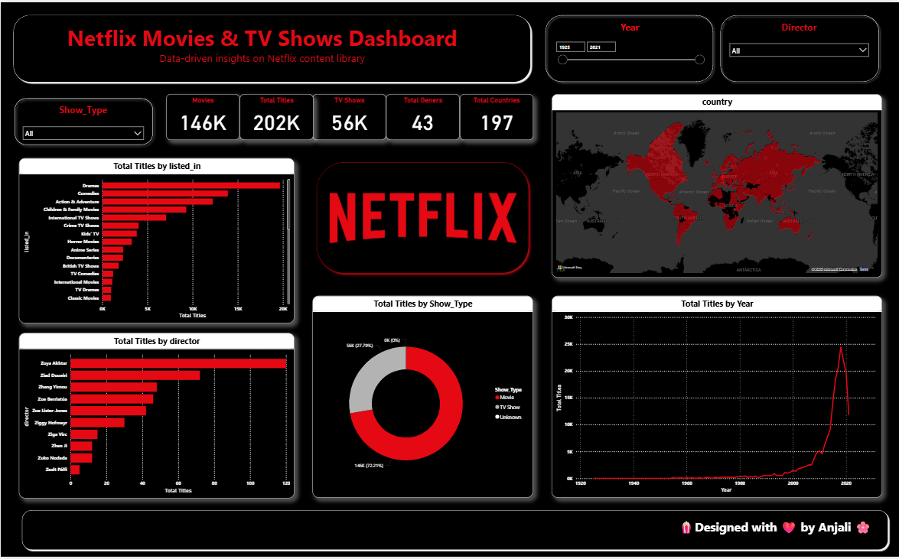

# 🎬 Netflix Movies & TV Shows Dashboard (Power BI)

This project is an **interactive Power BI dashboard** that provides **data-driven insights** into Netflix's content library.  
It helps explore the distribution of Movies & TV Shows, genres, release years, ratings, and country-wise content availability.  

---

## 📸 Dashboard Preview

---

## 📂 Repository Contents
- **Netflix_Dashboard.pbix** → Main Power BI file  
- **Netflix_ss/** → Screenshot of dashboard page 

---

## 🔑 Key Insights
- 📊 Breakdown of **Movies vs TV Shows**  
- 🌍 Content distribution by **country**  
- 🎭 Analysis of **genres**  
- 📅 Trends in content release over the years  
- ⭐ Top contributing countries to Netflix library  

---

## 🧰 How to Use
1. Download the `.pbix` file.  
2. Open it with **Power BI Desktop** (latest version).  
3. Refresh data sources if required.  

---

## 📝 Notes
- Data sourced from [Netflix Dataset on Kaggle](https://www.kaggle.com/shivamb/netflix-shows).  
- Built purely for **learning and visualization practice**.  

---

## 👩‍💻 Author
Designed & Developed by **Anjali Anil Jaisinghani** ✨
